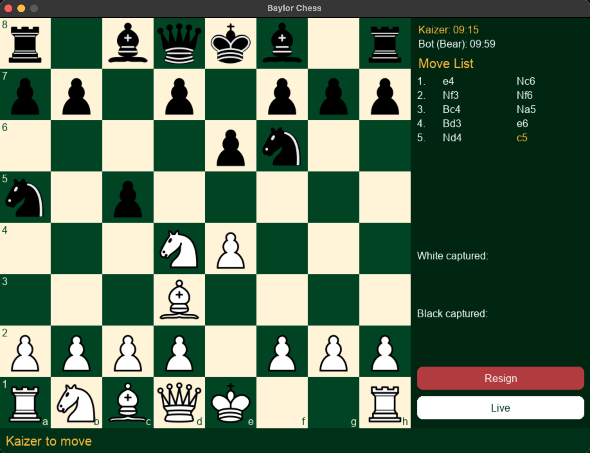

# Baylor Chess

A desktop chess application built in Python, featuring four tiers of computer opponents powered by adversarial search and a post-game review system that grades every move against engine analysis. Styled in Baylor University green and gold.



## Features

- **Four computer opponents**
  - **Easy:** plays random legal moves
  - **Medium:** minimax search at depth 2
  - **Hard:** alpha-beta pruning at depth 4 with a material evaluation
  - **Bear:** alpha-beta pruning at depth 4 with piece-square tables and mobility bonuses
- **Two-player local mode** with a coin flip for color assignment
- **Timed games** with per-player countdown clocks and selectable time controls
- **Move history sidebar** with a scrollable move list, captured pieces, and board navigation using the arrow keys
- **Post-game review:** compares each played move with the engine's best move, labels it good, ok, or bad by centipawn loss, and shows a color-coded move list, an evaluation graph, and board highlighting
- **JSON export** of every reviewed game for later analysis

## How the AI Works

Chess is a two-player, zero-sum game with perfect information, which makes it a natural fit for **minimax search**: the bot assumes its opponent always plays the best reply and chooses the move with the best worst-case outcome (backward induction).

**Alpha-beta pruning** speeds this up by skipping branches that cannot change the final decision. It returns the same move as plain minimax while searching far fewer positions, which is what lets the Hard and Bear bots look four moves ahead in Python.

The Bear bot's evaluation goes beyond counting material. **Piece-square tables** reward pieces for standing on strong squares (for example, knights in the center), and **mobility bonuses** reward positions with more legal moves.

## Getting Started

**Requirements:** Python 3.10+

```bash
pip install -r requirements.txt
python baylor_chess.py
```

## Built With

- [Python](https://www.python.org/)
- [pygame](https://www.pygame.org/) for the interface
- [python-chess](https://python-chess.readthedocs.io/) for move generation and rules
- Piece images from [Lichess](https://github.com/lichess-org/lila)

## Future Improvements

- Quiescence search to reduce the horizon effect
- Move ordering, iterative deepening, and a transposition table for faster search
- Training a machine learning position evaluator on the exported game data and benchmarking it against the hand-built evaluation

## Author

**Kaizer Briggs** · Data Science, Baylor University
